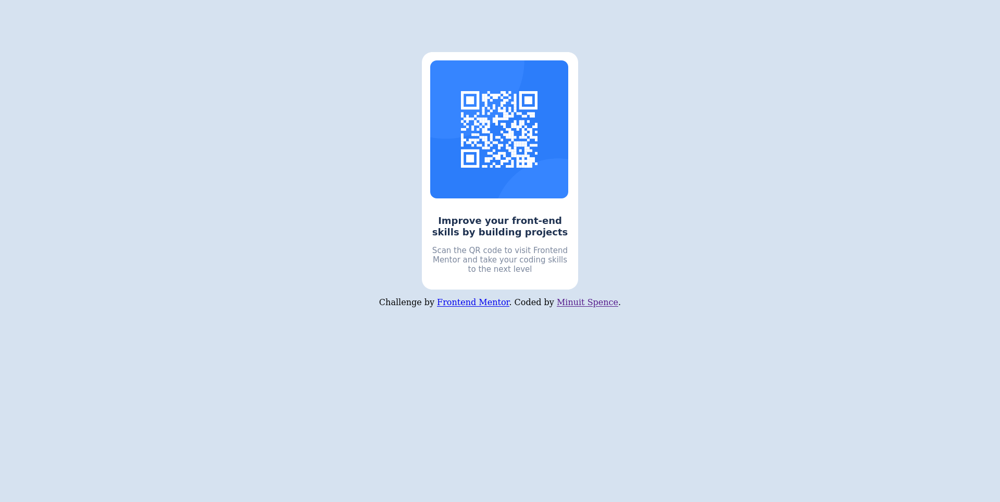

# Frontend Mentor - QR code component solution

This is a solution to the [QR code component challenge on Frontend Mentor](https://www.frontendmentor.io/challenges/qr-code-component-iux_sIO_H). Frontend Mentor challenges help you improve your coding skills by building realistic projects.

## Table of contents

- [Overview](#overview)
  - [Screenshot](#screenshot)
  - [Links](#links)
  - [Built with](#built-with)
- [Author](#author)
- [Acknowledgments](#acknowledgments)

## Overview

- This is my solution for a challenge I got from Frontend Mentor.

### Screenshot

### Links

- Solution URL: [Add solution URL here](https://github.com/seigiakatsuka/qr_code_challenge)
- Live Site URL: [Add live site URL here](https://seigiakatsuka.github.io/qr_code_challenge/)

### Built with

- Semantic HTML5 markup
- CSS custom properties

## Author

- Frontend Mentor - [@seigiakatsuka](https://www.frontendmentor.io/profile/seigiakatsuka)
- Github - [@seigiakatsuka](https://github.com/seigiakatsuka)
